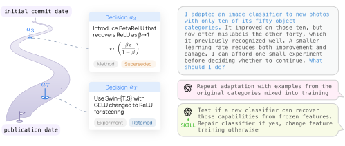

# ResearchTrails: Learning Scientific Exploration from Human Research Decisions Trajectories

<div align="center">
  <a href="https://arxiv.org"><b>Paper</b></a> •
  <a href="https://huggingface.co/researchtrails"><b>Data & Models</b></a> •
  <a href="https://www.researchtrails.org"><b>Blog</b></a> •
  <a href="https://www.researchtrails.org/visualizer"><b>Data Visualizer</b></a>
</div>

Papers record the final proposed method and experiment results, not how the authors get there. We turn the **Git commit history** of a paper into a **human research trajectory** and present a dataset containing 599 research trajectories made of 13K evidence-grounded **research decisions**. We show that learning from these trajectories, as demonstrations, distilled skills or as training data, helps models propose the next research decision better than learning from final papers alone.

<div align="center">

</div>

## Repository overview

| Folder | Paper | Contents |
|---|---|---|
| [`annotate/`](annotate/) | §3 | Build trajectories from repositories: paper/repository discovery, filtering, commit evidence, decision extraction and annotation. |
| [`harness/`](harness/) | §5.1 | Next-decision prediction with test-time harnesses (demonstrations, retrieved demonstrations, distilled skills), the decision-similarity judge, user simulations, and judge-quality studies. |
| [`sft/`](sft/) | §5.2 | Supervised fine-tuning of Qwen3-8B (LoRA) on decision sequences, prediction, and judging. |
| [`rl/`](rl/) | §5.2| RL from the SFT checkpoint with decision-similarity rewards (Dr. GRPO) and its per-epoch evaluation. |
| [`jobs/`](jobs/) | | Launch scripts for the annotation pipeline and the harness experiments reported in the paper. |

## Setup

```bash
# For annotation and harness (Python 3.12, standard library, and PyMuPDF)
python3 -m venv .venv
.venv/bin/pip install -r requirements.txt

# For SFT and RL (Install a PyTorch wheel matching your CUDA driver first; see sft/README.md; we use L40S x 1 for SFT and L40S x 4 for RL).
python3 -m venv sft/.venv
sft/.venv/bin/pip install -r sft/requirements.txt

# API keys
cp .env.example .env    # then fill in OPENROUTER_API_KEY and GITHUB_TOKEN
```

Evidence collection also needs `git` on the path. All language-model calls go through [OpenRouter](https://openrouter.ai) by default; `annotate/annotate_codex.py` and `annotate/annotate_claude.py` are CLI alternatives if one has codex/claude plans.

**Data.** The harness, SFT and RL code read trajectories from `annotations/neurips_<year>/<idx>-<owner>-<repo>/annotation.json`. Either download the released annotations with `hf download researchtrails/annotations --repo-type dataset --local-dir annotations`, or build them with the pipeline below.

## 1. Building trajectories (`annotate/`)

```bash
VENUE=NeurIPS YEAR=2025 bash jobs/annotate.sh
```

The job runs the pipeline's following `sample.py` -> `filter.py` -> `extract.py` -> `annotate_openrouter.py`. 

Each decision in `annotation.json` has its content, the supporting commits and code excerpts, a `category` (*method*, *experiment*, or *ablation*) and an `outcome` (*retained*, *superseded*, or *abandoned*), and is ordered by its first cited commit (`time_step_id`). The paper's annotations used GPT-5.6 Sol with xhigh reasoning. `prompt.txt` and `criteria.txt` hold the annotation instructions. More details are in `annotate/README.md`.

The index lists in `annotate/` define the subsets used in experiments: `harness_splits.json` holds the train, test, and prefix-length repositories of the harness experiments (its test repositories are also the SFT and RL test set), and `trajectory_selections.json` holds the winding and logically structured trajectories used for SFT and RL.

## 2. Predicting the next decision with harnesses (`harness/`)

The code produces the results in Section 5.1, with more details in `harness/README.md`.

| Paper result | Job |
|---|---|
| Prefix-length plateau | `jobs/prefix_length.sh`. `REBUILD=1 bash jobs/prefix_length.sh` first rebuilds its setting from the annotations. |
| Harness table | `jobs/harness_table.sh`. It reuses the paper's distilled skills, shuffled skills and final paper skill; `DISTILL=1 bash jobs/harness_table.sh` distills new ones first. |
| Judge variance and calibration (Appendix B) | `jobs/judge_quality.sh`. |
| Scores re-judged by Opus 5 (Appendix B) | `jobs/judge_grid.sh`. It re-judges the predictions of the three jobs above; its `rl` part also needs the training runs of Section 3. |
| User simulations | `harness/user_simulation/run.py` |

## 3. Training a next-decision policy (`sft/`, `rl/`)

Training uses the SFT environment (`sft/.venv`).

1. **SFT cold start.** `bash sft/run_sft.sh` prepares the decision sequences of the project splits in `sft/splits/` into `sft/data` and fine-tunes the paper's LoRA adapter on Qwen3-8B to model $\pi_\theta(a_t \mid p, a_{<t})$.
2. **RL with decision-similarity rewards.** `bash rl/run_grpo.sh` runs Dr. GRPO from the SFT checkpoint, sampling several decisions per prefix and rewarding each with its judged component plus operation match (0 for invalid generations).

The paper's SFT epoch-3 and GRPO epoch-7 adapters are released as [researchtrails/qwen3-8b-sft](https://huggingface.co/researchtrails/qwen3-8b-sft) and [researchtrails/qwen3-8b-grpo](https://huggingface.co/researchtrails/qwen3-8b-grpo). Details are in `sft/README.md` and `rl/README.md`.

## Citation

```bibtex
@article{gong2026researchtrails,
  title   = {Learning Scientific Exploration from Human Research Decisions Trajectories},
  author  = {Gong, Xuchen and Gu, Shane and Liu, Haokun and Yao, Dixi and Tan, Chenhao and Li, Tian},
  journal = {arXiv preprint},
  year    = {2026}
}
```
